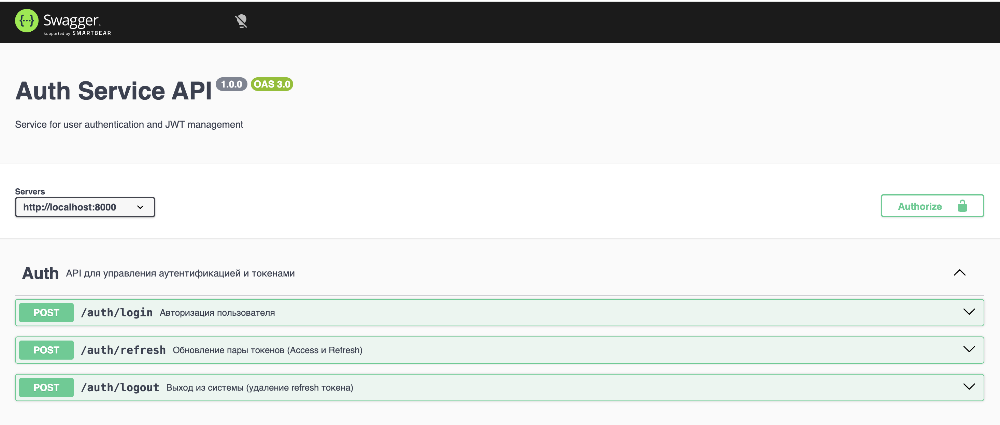
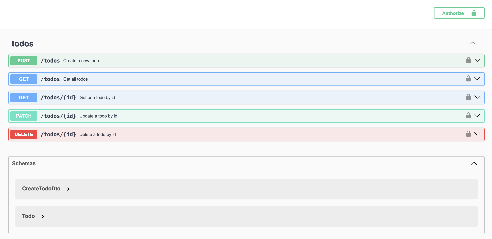

# 🚀 Microservices Auth & Todo System

Тестовое задание на позицию Backend Developer. Система состоит из двух независимых микросервисов, контейнеризированных с помощью Docker.

---

## 🛠 Tech Stack

| Component | Technology |
| :--- | :--- |
| **Frameworks** | NestJS, Express (Node.js) |
| **Databases** | PostgreSQL (TypeORM), MongoDB (Mongoose) |
| **Auth** | JWT (Access & Refresh tokens) |
| **Docs** | Swagger (OpenAPI 3.0) |
| **DevOps** | Docker, Docker Compose |

---

## 🔐 Main Features

### Auth Service
* **JWT Authentication**: Выдача пары Access Token (1 час) и Refresh Token.
* **Token Refresh**: Механизм автоматического обновления токенов.
* **Security**: Хеширование паролей и валидация входящих данных.

### Todo Service (CRUD)
* **Operations**: Полный цикл CRUD для задач.
* **Access Control**: Доступ только для авторизованных пользователей через проверку JWT.
* **Validation**: Строгая проверка данных через `class-validator`.

---

## 📁 Project Structure

```text
microservices/
├── auth-service/          # Микросервис авторизации
│   ├── controllers/       # Обработка логики
│   ├── models/            # Схемы MongoDB
│   ├── fixtures.ts        # Seed-скрипт (наполнение БД)
│   └── Dockerfile         
├── todo-service/          # Микросервис задач (NestJS)
│   ├── src/               # Бизнес-логика (PostgreSQL)
│   ├── fixtures.ts        # Seed-скрипт
│   └── Dockerfile         
├── docs/                  # Скриншоты документации
├── compose.yaml           # Оркестрация контейнеров
└── README.md              
🐳 Docker Deployment
Запуск всей системы одной командой:

Bash
docker compose up --build -d
Доступ к API и Swagger:
Auth Service: http://localhost:8000/api-docs

Todo Service: http://localhost:8021/api/docs

📝 API Specification
1. Auth Service
Обеспечивает вход и управление сессиями.
POST /auth/login — Вход (email/password).
POST /auth/refresh — Обновление токенов.

2. Todo Service
Управление списком дел. Требует Authorization: Bearer <token> в заголовках.
GET /todos — Получение списка.
POST /todos — Создание (валидация title).
